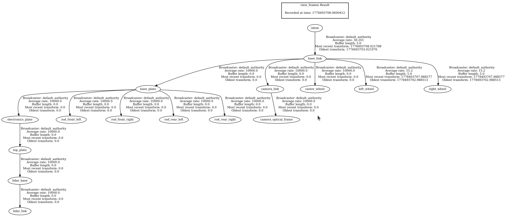

# ROS2-Robot

---

### Убедитесь что `RMW_ZEHOH` настроен на одной машине как серве, на другой как клиент, и запущен на сервер-машине

---

## RMW_ZENOH_CPP
### Один раз на сервере!
```bash
echo "export RMW_IMPLEMENTATION=rmw_zenoh_cpp" >> ~/.bashrc
echo "export ZENOH_ROUTER_CONFIG_URI=/home/ivan/routerconfig.json5" >> ~/.bashrc
source ~/.bashrc
```
Каждый раз, когда перезапускаете компьюетер. (Включили и забыли)
```bash
ros2 run rmw_zenoh_cpp rmw_zenohd --config ~/ros2_ws/zenoh_router.json5 # запуск сервера на одной машине
```

На другом устройстве ничего едлать не надо, надо просто настроить переменные среды.
### Один раз на клиенте!
```bash
echo "export RMW_IMPLEMENTATION=rmw_zenoh_cpp" >> ~/.bashrc
echo "ZENOH_SESSION_CONFIG_URI=/home/admin/.config/zenoh/session_config.json5" >> ~/.bashrc
source ~/.bashrc
```
И всё.

---

## Запуск
Для простого запуска управления робота через `ros2_control` и `teleop_twist_keyboard`
```bash
# На роботе
ros2 launch view_robot launch_robot.launch.py
# В другом теминале или устройстве
ros2 run teleop_twist_keyboard teleop_twist_keyboard   --ros-args   --remap cmd_vel:=/diff_cont/cmd_vel   -p stamped:=true   -p frame_id:=base_link
```

Струтура топиков в обычном режиме:
```bash
ivan@ivan-HP-EliteBook-745-G6:~/ROS2-Robot$ ros2 topic list
/camera_info
/clicked_point
/controller_manager/activity
/controller_manager/introspection_data/full
/controller_manager/introspection_data/names
/controller_manager/introspection_data/values
/controller_manager/statistics/full
/controller_manager/statistics/names
/controller_manager/statistics/values
/diagnostics
/diff_cont/cmd_vel
/diff_cont/odom
/diff_cont/transition_event
/dynamic_joint_states
/goal_pose
/image_raw
/initialpose
/joint_broad/transition_event
/joint_states
/parameter_events
/robot_description
/rosout
/scan
/tf
/tf_static
```
Запущенные ноды:
```bash
admin@ROBOT:~$ ros2 node list
/controller_manager
/diff_cont
/joint_broad
/realrobot
/robot_state_publisher
/rviz
/sllidar_node
/teleop_twist_keyboard
/transform_listener_impl_5cdf62ba9850
```
## Трансформации:


## Rviz demo:


---

## ROS2 Control
https://control.ros.org/jazzy/doc/ros2_control/controller_manager/doc/userdoc.html

---

## ROS2 Joint State Broadcaster
https://control.ros.org/jazzy/doc/ros2_controllers/joint_state_broadcaster/doc/userdoc.html

---

## DiffDriveArduino Ros2 Control Plugin
https://github.com/joshnewans/diffdrive_arduino
