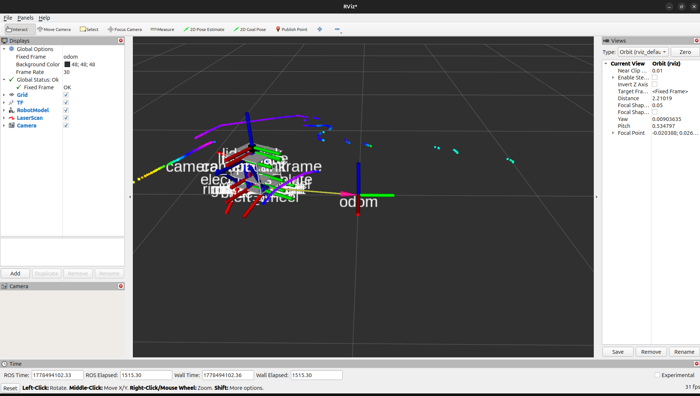
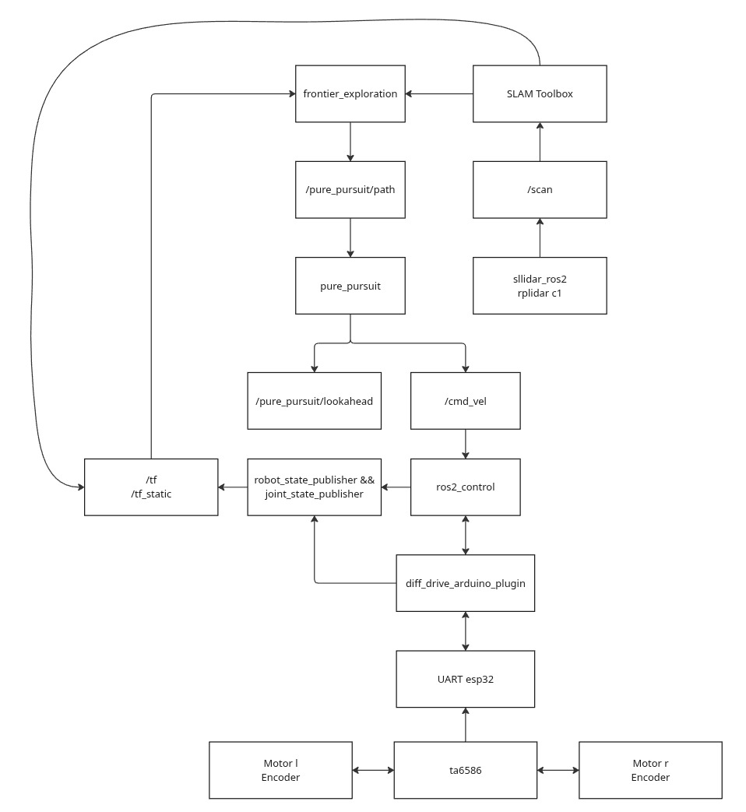

# ROS2-Robot

---

### Убедитесь что `RMW_ZEHOH` настроен на одной машине как сервер, на другой - как клиент, и запущен на сервер-машине

---

## RMW_ZENOH_CPP
### Один раз на сервере!
```bash
echo "export RMW_IMPLEMENTATION=rmw_zenoh_cpp" >> ~/.bashrc
echo "export ZENOH_ROUTER_CONFIG_URI=/home/ivan/routerconfig.json5" >> ~/.bashrc
source ~/.bashrc
```
Каждый раз, когда перезапускаете компьюетер. (Включили и забыли)
```bash
ros2 run rmw_zenoh_cpp rmw_zenohd --config ~/ros2_ws/zenoh_router.json5 # запуск сервера на одной машине
```

На другом устройстве ничего едлать не надо, надо просто настроить переменные среды.
### Один раз на клиенте!
```bash
echo "export RMW_IMPLEMENTATION=rmw_zenoh_cpp" >> ~/.bashrc
echo "ZENOH_SESSION_CONFIG_URI=/home/admin/.config/zenoh/session_config.json5" >> ~/.bashrc
source ~/.bashrc
```
И всё.

### Ошибки во время работы `RMW_ZENOH`
Если при работе более чем с двумя машинами, происходят такие ошибки:
```error
ERROR rx-1 ThreadId(05) zenoh::net::routing::dispatcher::pubsub: Error treating timestamp for received Data (incoming timestamp from exceeding delta 500ms is rejected: ). Replace timestamp: Some
```
То проблема в том, что время  на машинах расходится более чем на 500мс, решения 4 штуки:
1. Поставить точное время при помощи `rtc`. Гайд по [ссылке](https://www.instructables.com/Raspberry-Pi-DS3231/).
2. Каждыдй раз при запуске системы ставить точное время вручную:
   ```bash
   sudo date --set "YYYY-MM-DD HH:MM:SS"
   ```
3. Брать время из интернета:
   ```bash
   sudo ntpdate pool.ntp.org
   ```
4. Просто убрать ошибки от соединений `rmw_zenoh`, [инструкция](https://zenoh.io/docs/getting-started/troubleshooting/):
   ```bash
   export RUST_LOG=off # Убрать все ошибки, предупреждения, информацию и т.д.
   ```

---

## Запуск
Для простого запуска управления робота через `ros2_control` и `teleop_twist_keyboard`
```bash
# На роботе
ros2 launch view_robot launch_robot.launch.py
# В другом теминале или устройстве
ros2 run teleop_twist_keyboard teleop_twist_keyboard   --ros-args   --remap cmd_vel:=/diff_cont/cmd_vel   -p stamped:=true   -p frame_id:=base_link
```

Можно также запустить просто launch для робота и launch для джойстика
```bash
# На роботе
ros2 launch view_robot launch_robot.launch.py
# В другом теминале другого устройства
ros2 launch view_robot launch_joy.launch.py
```

Джойстик сделан на основе `Arduino UNO R3` и `Joystick Shield V1.A`. Достаточно просто залить прошивку на неё.

Струтура топиков в обычном режиме:
```bash
ivan@ivan-HP-EliteBook-745-G6:~/ROS2-Robot$ ros2 topic list
/camera_info
/clicked_point
/controller_manager/activity
/controller_manager/introspection_data/full
/controller_manager/introspection_data/names
/controller_manager/introspection_data/values
/controller_manager/statistics/full
/controller_manager/statistics/names
/controller_manager/statistics/values
/diagnostics
/diff_cont/cmd_vel
/diff_cont/odom
/diff_cont/transition_event
/dynamic_joint_states
/goal_pose
/image_raw
/initialpose
/joint_broad/transition_event
/joint_states
/parameter_events
/robot_description
/rosout
/scan
/tf
/tf_static
```
Запущенные ноды:
```bash
admin@ROBOT:~$ ros2 node list
/controller_manager
/diff_cont
/joint_broad
/realrobot
/robot_state_publisher
/rviz
/sllidar_node
/teleop_twist_keyboard
/transform_listener_impl_5cdf62ba9850
```
## Трансформации:


## Rviz demo:


## Схемы коммуникациями между нодами


---

## SLAM
Используется `slam_toolbox` для построения 2d карты окрестности, но также это можно сделать и спомощью `ICP_SLAM`.
Файл с параметрами для `online_async_launch.py` находится в дириктории `config` у `view_robot` пакета.

### Запуск
```bash
ros2 launch slam_toolbox online_async_launch.py # Просто запуск со стандартными параметрами
ros2 launch slam_toolbox online_async_launch.py slam_params_file:=~/ros2_ws/src/view_robot/config/mapper_params_online_async.yaml
```

### Сохранения карты от `Slam_Toolbox`:
Откройте `Rviz2` и во вкладке `Panels` -> `Add New Panel` выберите `SlamToolbox...`
Наберите имя карты без расширения и нажнимате `save`, а потом наберите тоже имя и нажмите `serialize`.

### Публикация готовой карты
Чтобы начать пуликовать готовую карту для `AMCL` и других нод для локализации, нужно вызвать следующие команды
```bash
ros2 run nav2_map_server map_server --ros-args -p yaml_filename:=~/map.yaml # В одном терминале
ros2 run nav2_util lifecycle_bringup map_server # В другом, чтобы запустить публикацию карты
```

### AMCL
Можно использовать `AMCL` из `Nav2` стека, чтобы ориентироваться по сохраненной карте
```bash
ros2 run nav2_amcl amcl # в одном терминале
ros2 run nav2_util lifecycle_bringup amcl # В другом терминале, чтобы запустить AMCL
```

---

## ROS2 Control
ссылка на сдокументацию: https://control.ros.org/jazzy/doc/ros2_control/controller_manager/doc/userdoc.html

Для нормальной работы робот с дифференциальной платформой нужны свои параметры в `ros2 control diff_drive_controller`. У меня они такие:
```yaml
controller_manager:
  ros__parameters:
    update_rate: 30
    use_sim_time: false
    enable_statistics: false 
    use_stamped_vel: false

    diff_cont:
      type: diff_drive_controller/DiffDriveController
      
    joint_broad:
      type: joint_state_broadcaster/JointStateBroadcaster

#https://control.ros.org/rolling/doc/ros2_controllers/diff_drive_controller/doc/userdoc.html
diff_cont:
  ros__parameters:
    publish_rate: 50.0
    left_wheel_names: ["left_wheel_joint"]
    right_wheel_names: ["right_wheel_joint"]

    wheel_separation: 0.19
    wheel_radius: 0.0345

    use_stamped_vel: false

    wheel_separation_multiplier: 1.0
    left_wheel_radius_multiplier: 1.0
    right_wheel_radius_multiplier: 1.0

    odom_frame_id: odom
    base_frame_id: base_footprint
    pose_covariance_diagonal: [0.0, 0.0, 0.0, 0.0, 0.0, 0.0]
    twist_covariance_diagonal: [0.0, 0.0, 0.0, 0.0, 0.0, 0.0]

    position_feedback: true
    open_loop: false
    enable_odom_tf: true

    cmd_vel_timeout: 0.5 # seconds
    publish_limited_velocity: false
    velocity_rolling_window_size: 10

    linear.x.max_velocity: 1.0
    linear.x.min_velocity: -1.0
    linear.x.max_acceleration: .NAN
    linear.x.max_deceleration: .NAN
    linear.x.max_acceleration_reverse: .NAN
    linear.x.max_deceleration_reverse: .NAN
    linear.x.max_jerk: .NAN
    linear.x.min_jerk: .NAN

    angular.z.max_velocity: 1.0
    angular.z.min_velocity: -1.0
    angular.z.max_acceleration: .NAN
    angular.z.max_deceleration: .NAN
    angular.z.max_acceleration_reverse: .NAN
    angular.z.max_deceleration_reverse: .NAN
    angular.z.max_jerk: .NAN
    angular.z.min_jerk: .NAN

# joint_state_broadcaster:
#   ros__parameters:
#     extra_joints: '{}'
#     frame_id: base_link
#     interfaces: '{}'
#     joints: '{}'
#     map_interface_to_joint_state:
#       effort: effort
#       position: position
#       velocity: velocity
#     publish_dynamic_joint_states: false
#     use_local_topics: false
#     use_urdf_to_filter: true
```
Ковариация ещё не настроена, но это уже не важно. 

Также нужно настроить параметры робота в `ros2_control.xacro`:
```xml
<?xml version="1.0"?>
<robot xmlns:xacro="http://www.ros.org/wiki/xacro">


    <ros2_control name="RealRobot" type="system">
        <hardware>
            <plugin>diffdrive_arduino/DiffDriveArduinoHardware</plugin>
            <param name="left_wheel_name">left_wheel_joint</param>
            <param name="right_wheel_name">right_wheel_joint</param>
            <param name="loop_rate">30</param>
            <param name="device">/dev/ttyUSB0</param>
            <param name="baud_rate">115200</param>
            <param name="timeout_ms">1000</param>
            <param name="enc_counts_per_rev">440</param>
            <param name="pid_p">20</param>
            <param name="pid_d">25</param>
            <param name="pid_i">2</param>
            <param name="pid_o">50</param>
        </hardware>
        <joint name="left_wheel_joint">
            <command_interface name="velocity">
                <param name="min">-10</param>
                <param name="max">10</param>
            </command_interface>
            <state_interface name="position"/>  <!-- position первым! -->
            <state_interface name="velocity"/>
        </joint>
        <joint name="right_wheel_joint">
            <command_interface name="velocity">
                <param name="min">-10</param>
                <param name="max">10</param>
            </command_interface>
            <state_interface name="position"/>  <!-- position первым! -->
            <state_interface name="velocity"/>
        </joint>
    </ros2_control>

</robot>
```

---

## Camera

Я использую веб камеру `Dexp`, раззобранную. К ней припаяны доп конденсаторы, и коннектор, для подключения либо через `UART пины`, либо через `USB провод`.

Чтобы можно было использовать изображение с камеры в ros2, нужно запустить один из паблишеров изображения:
 - `camera_ros`
 - `v4l2`

Чтобы удобно отклибровать камеру, нужно воспользоваться `camera_ros` `camera_calibrator`. 

---

## PID

Коэффициенты PID можно настроить в двух местах:
 - В `ros2_control.xacro`
 - В `ArduinoROS.ino`

И там и там есть возможностьнастроить постоянные PID коэффициенты. 

---

## ROS2 Joint State Broadcaster
https://control.ros.org/jazzy/doc/ros2_controllers/joint_state_broadcaster/doc/userdoc.html

---

## DiffDriveArduino Ros2 Control Plugin
Есть [оригинал](https://github.com/joshnewans/diffdrive_arduino), в нём нету imu.  
[Моя версия](https://github.com/IvanS297/diffdrive_arduino/tree/humble) (форк, есть в папке src/), Я добавил IMU паблишер.  
Если скачивать мою версию отдельно куда-либо, то необходимо сделать `git chechout humble`.

IMU publisher:
 - `/imu/data_raw` - данные акселерометра в м/с^2 и гироскопа в rad/s
 - `/imu/mag` - данные магнетометра в теслах

## IMU Filter Madgwick:
Задействован фильтр Маджвика для того, чтобы корректировать дрейф IMU.
Он публикует `/imu/data` - Отфильтрованные данные IMU.  
Запуск:
```bash
ros2 run imu_filter_madgwick imu_filter_madgwick_node --ros-args   -p use_mag:=true   -p publish_tf:=false   -p world_frame:=enu   -p gain:=0.5
```

## Robot Localization (EKF)

Используется `Extended Kalman Filter` для того, чтобы сделать `sensor fusion` - объеденить колёсную одометрию и IMU, можно также добавить одометрию от `ICP`.
`ekf.yaml`:
```yaml
ekf_filter_node:
  ros__parameters:
    frequency: 30.0
    two_d_mode: true
    publish_tf: true
    print_diagnostics: true
    sensor_timeout: 0.1

    map_frame: map
    odom_frame: odom
    base_link_frame: base_link
    world_frame: odom

    odom0: /diff_cont/odom
    odom0_config: [false, false, false,
                  false, false, false,
                  true,  false, false,
                  false, false, true,
                  false, false, false]

    imu0: /imu/data
    imu0_config: [false, false, false,
              false, false, false,
              false, false, false,
              false, false, true,
              false, false, false]
    sensor_timeout: 0.1
    imu0_remove_gravitational_acceleration: true
```
